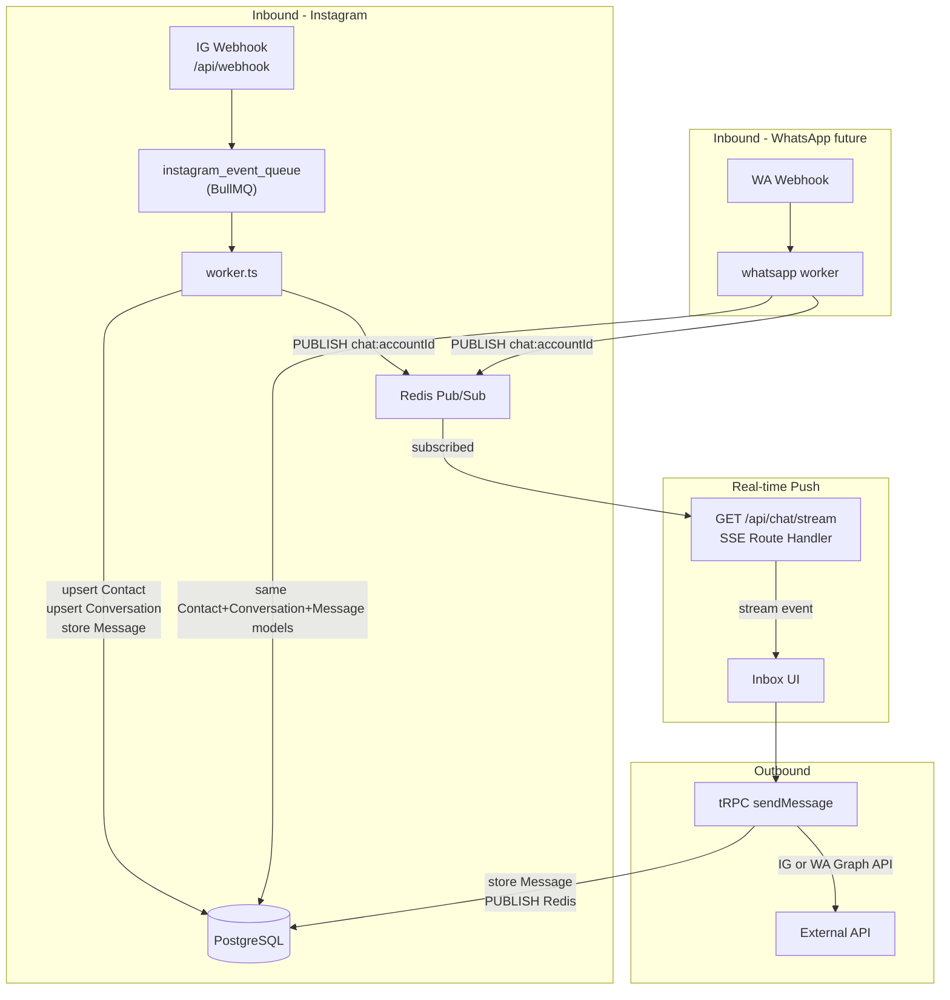

# Multi-Channel DM Chat System

## Why Multi-Channel Schema Now

The app will later add WhatsApp Business (campaigns, template broadcasting, imported contacts). Designing the schema as Instagram-only now would require a painful migration later. The changes below add a `platform` enum, a `Conversation` intermediary, and placeholder WhatsApp/Campaign models — so the inbox UI and worker logic stay identical regardless of channel.

## Architecture



## 1. Prisma Schema — Multi-Channel Design

File: [`prisma/schema.prisma`](prisma/schema.prisma)

### Core shared models

```prisma
enum Platform {
  INSTAGRAM
  WHATSAPP
}

enum MessageDirection {
  INBOUND
  OUTBOUND
}

// Channel-agnostic contact. One row per person per platform account.
model Contact {
  id              String    @id @default(cuid())
  platform        Platform
  externalId      String    // IG user ID or WA phone number
  name            String?
  username        String?   // Instagram
  phone           String?   // WhatsApp
  profilePicture  String?
  importSource    String?   // "automation" | "csv" | "xlsx"
  createdAt       DateTime  @default(now())
  updatedAt       DateTime  @updatedAt

  // platform-specific account links (only one set per row)
  instagramAccountId String?
  instagramAccount   InstagramAccount? @relation(fields: [instagramAccountId], references: [id], onDelete: Cascade)
  whatsappAccountId  String?
  whatsappAccount    WhatsAppAccount?  @relation(fields: [whatsappAccountId], references: [id], onDelete: Cascade)

  conversations   Conversation[]
  campaignContacts CampaignContact[]

  @@unique([externalId, instagramAccountId])
  @@unique([externalId, whatsappAccountId])
  @@index([instagramAccountId])
  @@index([whatsappAccountId])
}

// One conversation per Contact+Account pair. Groups all messages.
model Conversation {
  id                 String    @id @default(cuid())
  contactId          String
  contact            Contact   @relation(fields: [contactId], references: [id], onDelete: Cascade)
  platform           Platform
  lastMessageAt      DateTime?
  lastMessagePreview String?
  unreadCount        Int       @default(0)
  createdAt          DateTime  @default(now())
  updatedAt          DateTime  @updatedAt

  instagramAccountId String?
  instagramAccount   InstagramAccount? @relation(fields: [instagramAccountId], references: [id], onDelete: Cascade)
  whatsappAccountId  String?
  whatsappAccount    WhatsAppAccount?  @relation(fields: [whatsappAccountId], references: [id], onDelete: Cascade)

  messages           Message[]

  @@unique([contactId, instagramAccountId])
  @@unique([contactId, whatsappAccountId])
  @@index([instagramAccountId, lastMessageAt(sort: Desc)])
  @@index([whatsappAccountId, lastMessageAt(sort: Desc)])
}

model Message {
  id                String           @id @default(cuid())
  conversationId    String
  conversation      Conversation     @relation(fields: [conversationId], references: [id], onDelete: Cascade)
  externalMessageId String?          @unique  // IG or WA message ID for idempotency
  direction         MessageDirection
  content           String?
  mediaUrl          String?
  templateId        String?          // WA template reference
  sentAt            DateTime         @default(now())
  isRead            Boolean          @default(false)

  @@index([conversationId, sentAt])
}
```

### WhatsApp-specific models (schema only, not implemented yet)

```prisma
model WhatsAppAccount {
  id              String   @id @default(cuid())
  userId          String
  user            User     @relation(fields: [userId], references: [id], onDelete: Cascade)
  phoneNumberId   String   @unique  // WA Business API phone number ID
  wabaId          String            // WhatsApp Business Account ID
  accessToken     String
  displayName     String?
  createdAt       DateTime @default(now())

  contacts        Contact[]
  conversations   Conversation[]
  templates       WhatsAppTemplate[]
  campaigns       Campaign[]
}

model WhatsAppTemplate {
  id              String   @id @default(cuid())
  whatsappAccountId String
  whatsappAccount WhatsAppAccount @relation(fields: [whatsappAccountId], references: [id], onDelete: Cascade)
  name            String
  language        String
  category        String           // MARKETING | UTILITY | AUTHENTICATION
  components      Json             // header, body, footer, buttons
  status          String           // APPROVED | PENDING | REJECTED
  externalId      String?          // WA template ID
  createdAt       DateTime @default(now())
}

enum CampaignStatus {
  DRAFT
  RUNNING
  COMPLETED
  FAILED
}

model Campaign {
  id                String         @id @default(cuid())
  whatsappAccountId String
  whatsappAccount   WhatsAppAccount @relation(fields: [whatsappAccountId], references: [id], onDelete: Cascade)
  name              String
  templateId        String?
  status            CampaignStatus @default(DRAFT)
  scheduledAt       DateTime?
  createdAt         DateTime       @default(now())
  updatedAt         DateTime       @updatedAt

  campaignContacts  CampaignContact[]
}

model CampaignContact {
  id          String   @id @default(cuid())
  campaignId  String
  campaign    Campaign @relation(fields: [campaignId], references: [id], onDelete: Cascade)
  contactId   String
  contact     Contact  @relation(fields: [contactId], references: [id], onDelete: Cascade)
  status      String   // pending | sent | delivered | read | failed
  sentAt      DateTime?
  error       String?

  @@unique([campaignId, contactId])
}
```

Also add `contacts Contact[]`, `conversations Conversation[]` to `InstagramAccount`, and `whatsappAccounts WhatsAppAccount[]` to `User`.

## 2. Worker — capture inbound DMs + publish Redis event

File: [`src/lib/worker.ts`](src/lib/worker.ts)

In the `instagram_event_queue` worker, extend the `data.messaging` branch:

1. Skip `is_echo: true` and `is_self` (outbound echoes).
2. For every real inbound DM:
   - `upsert` a `Contact` by `{ externalId: senderIgUserId, instagramAccountId }` — fetch IG profile if new.
   - `upsert` a `Conversation` by `{ contactId, instagramAccountId }`.
   - `create` a `Message` with `direction: INBOUND`, `externalMessageId` (idempotency), `content`.
   - Update `Conversation.lastMessageAt`, `lastMessagePreview`, increment `unreadCount`.
   - `redis.publish(\`chat:${instagramAccountId}\`, JSON.stringify({ type: "new_message", conversationId, message }))`.

## 3. SSE Route Handler

New file: `src/app/api/chat/stream/route.ts`

```ts
export async function GET(req: Request) {
  const accountId = ...; // from session (active Instagram account)

  const stream = new ReadableStream({
    async start(controller) {
      const subscriber = redis.duplicate();
      await subscriber.connect();
      await subscriber.subscribe(`chat:${accountId}`, (message) => {
        controller.enqueue(`data: ${message}\n\n`);
      });
      req.signal.addEventListener("abort", () => {
        subscriber.unsubscribe();
        subscriber.disconnect();
        controller.close();
      });
    },
  });

  return new Response(stream, {
    headers: {
      "Content-Type": "text/event-stream",
      "Cache-Control": "no-cache",
      Connection: "keep-alive",
    },
  });
}
```

- Uses `redis.duplicate()` — a subscribed Redis client cannot run other commands.
- Channel key: `chat:{accountId}` — scoped per account, works for both IG and WA accounts.
- Cleans up on browser disconnect via `abort` signal.

## 4. tRPC procedures

File: [`src/trpc/routers/_app.ts`](src/trpc/routers/_app.ts)

Add a `chat` sub-router:

- `getContacts` — returns `Conversation[]` with nested `Contact` for active account, ordered by `lastMessageAt desc`.
- `getMessages(conversationId, cursor?)` — paginated `Message[]`; resets `unreadCount` to 0 on fetch.
- `sendMessage(conversationId, content)` — calls `sendPlainMessageToUser` (IG) or WA API (future), stores outbound `Message`, updates `Conversation`, publishes Redis event.
- `markAsRead(conversationId)` — sets `unreadCount = 0`, marks messages `isRead = true`.

## 5. Inbox UI

New file: `src/app/(dashboard)/inbox/page.tsx`

Two-panel layout:

- **Left panel** — `ContactList`: renders `Conversation[]` with contact avatar, name, last message preview, timestamp, unread badge.
- **Right panel** — `ChatWindow`: message bubbles (sent right / received left), text input + send. Opens `EventSource` to `/api/chat/stream` and appends incoming events to local state — no refetch needed.

## 6. New component files

- `src/components/ContactList.tsx` — conversation list with unread badges.
- `src/components/ChatWindow.tsx` — SSE-powered message thread + send input.

## Migration

Run `prisma migrate dev --name add_multichannel_chat` after schema changes.

## Key files changed

- [`prisma/schema.prisma`](prisma/schema.prisma) — new multi-channel models
- [`src/lib/worker.ts`](src/lib/worker.ts) — capture inbound DMs + Redis publish
- [`src/trpc/routers/_app.ts`](src/trpc/routers/_app.ts) — chat procedures
- `src/app/api/chat/stream/route.ts` — SSE Route Handler (new)
- `src/app/(dashboard)/inbox/page.tsx` — inbox page (new)
- `src/components/ContactList.tsx` — contact list (new)
- `src/components/ChatWindow.tsx` — chat window with SSE (new)
- Dashboard sidebar nav — add Inbox link
